# Pickle Rick

## Enumeration

### Nmap (RustScan)

```bash
$ rustscan -a <TARGET_IP> -- -A

PORT   STATE SERVICE VERSION
22/tcp open  ssh     OpenSSH 8.2p1 Ubuntu 4ubuntu0.11 (Ubuntu Linux; protocol 2.0)
80/tcp open  http    Apache httpd 2.4.41 ((Ubuntu))
|_http-server-header: Apache/2.4.41 (Ubuntu)
|_http-title: Rick is sup4r cool
```

> The scan showed 2 open TCP ports; 22 and 80, which was expected since the description already states it’s a web application.
> 

### PORT22 (SSH)

I attempted to authenticate to SSH as the `root` user.

```bash
$ ssh root@<TARGET_IP>
root@<TARGET_IP>: Permission denied (publickey).
```

Rather than prompting for a password, the server rejected the attempt with `Permission denied (publickey)`. This indicated that public-key authentication was required for the attempted root login, so password-based SSH access as root was not a viable path.

### PORT80 (HTTP)

```bash
80/tcp open  http    Apache httpd 2.4.41 ((Ubuntu))
|_http-server-header: Apache/2.4.41 (Ubuntu)
|_http-title: Rick is sup4r cool
```

#### Content Discovery

```bash
$ dirsearch -u http://<TARGET_IP>

[301] /assets  ->  http://<TARGET_IP>/assets/
[200] /assets/
[200] /login.php
[200] /robots.txt
[403] /server-status/
```

> Discovered `/login.php` and `/robots.txt`.
> 

#### Inspecting the site

- Source code:

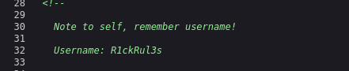

Found a username exposed in the source code:

`Username: R1ckRul3s`

- `/robots.txt`:

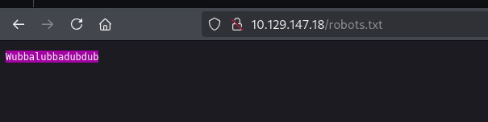

`Wubbalubbadubdub`

At this point, I had a username from the page source and an interesting string from `/robots.txt`. I tested the combination against the login page.

```
Username: R1ckRul3s
Password: Wubbalubbadubdub
```

## Initial Access

I used the username found in the source code and the string from `/robots.txt` to log in to the application via `/login.php`. I could run commands from the `Commands` tab, but accessing any other tab sent me to `/denied.php`.

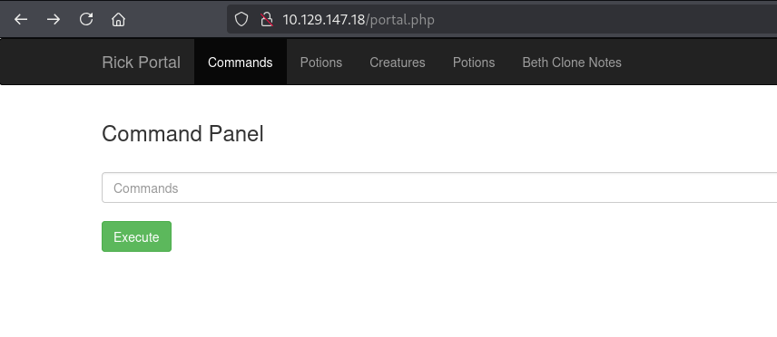

## Getting The Flags

### First Flag

Using `ls -la`, we are able to list all the files in the current folder, which includes `Sup3rS3cretPickl3Ingred.txt` and `clue.txt`.

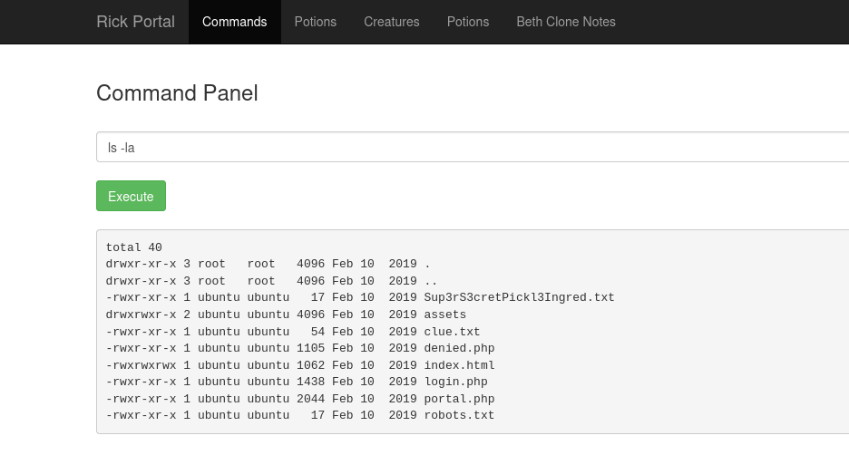

However, we won’t be able to `cat` any of them because the command is disabled.

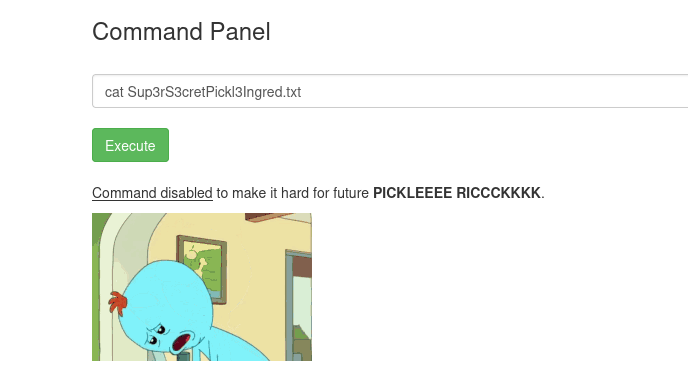

Since we can’t use the `cat` command to view the files, we can try other alternatives such as `less` or `head`. I used `less` first and was able to get the first flag.

`mr. meeseek hair`

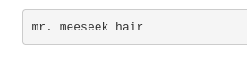

(I tried `head`, which was also disabled, so I decided not to test any other command since I had already gotten it.)

### Second Flag

Reading the content of `clue.txt`:

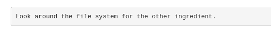

*we would’ve done this without the clue*

Started “`ls`-ing” from the root (`/`) directory and worked my way down to `/home/rick`, where I found `second ingredients`.

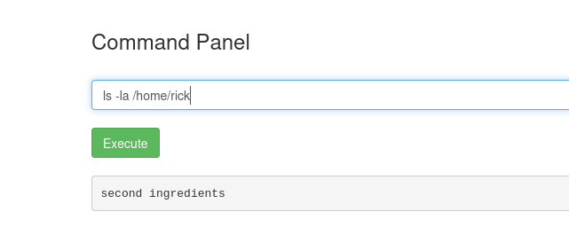

Don’t forget that the `cat` command is disabled, so I first tried:

```bash
less /home/rick/second ingredient
```

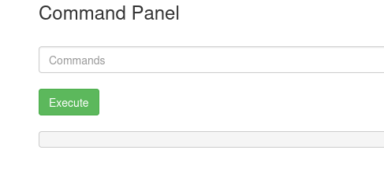

Hmm… nothing happens. That’s because the space in the filename affects how the shell interprets the command. We can work around this by using quotes:

```bash
less "/home/rick/second ingredients"
```

Or by escaping the space with a backslash:

```bash
less /home/rick/second\ ingredients
```

They both work and can be used to get the second flag

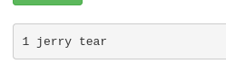

`1 jerry tear`

### Third Flag

There’s only one flag left, the root flag. I used the `whoami` command the moment I logged into the web app and saw that I was `www-data`, who, unfortunately for us, isn’t root. So we need to escalate our privileges to get the root flag.

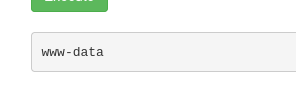

The first step to privilege escalation is finding out who we are (we did that above) and **what we can do**. We can find this out using the `sudo -l` command, which lists what sudo privileges the current user has — basically, “what am I allowed to run as another user (usually root)?”

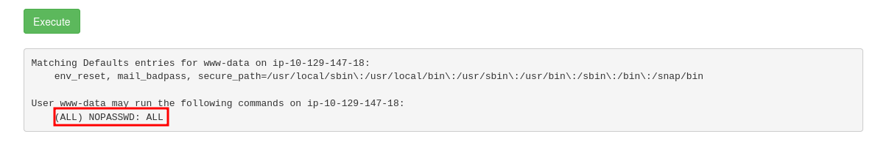

Here we can see that our current user can run any command as any user (including root), with no password required. This sudo configuration gives us a direct privilege-escalation path and allows us to run this….

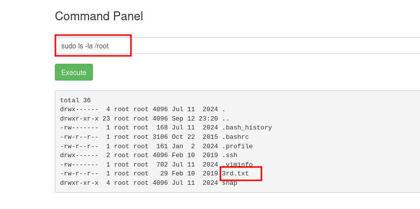

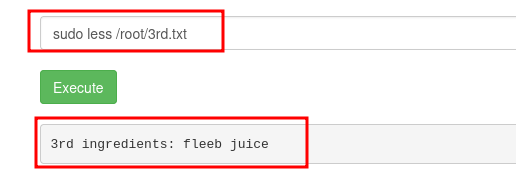

…and get the third flag.

`fleeb juice`

And that’s it! All 3 flags for this room

## Conclusion

This room reinforced the importance of thorough web enumeration and checking simple information-disclosure issues before attempting more complex attacks. The main techniques I practiced were service enumeration with RustScan and Nmap, web content discovery with Dirsearch, source-code and `robots.txt` inspection, Linux filesystem navigation, handling filenames containing spaces, and identifying an insecure sudo configuration for privilege escalation.

This is also my **first cybersecurity write-up** and the first one I'll be publishing on my Field Notes website as part of my portfolio. My goal with these write-ups is not just to document how I completed a room, but to keep a record of what I'm learning, improve how I explain my methodology, and show my progress as I continue developing my penetration-testing skills.

I also want these notes to be useful to other people learning cybersecurity, especially beginners who might be encountering some of these tools and techniques for the first time. Rather than simply listing commands and answers, I'll try to explain **why** I took certain steps, what the results meant, and how they influenced what I tried next. Hopefully, someone working through the same concepts can learn something from my process as I learn along the way.

This is the first of many.